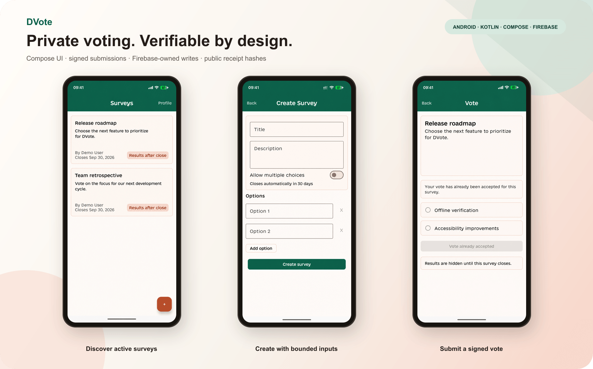
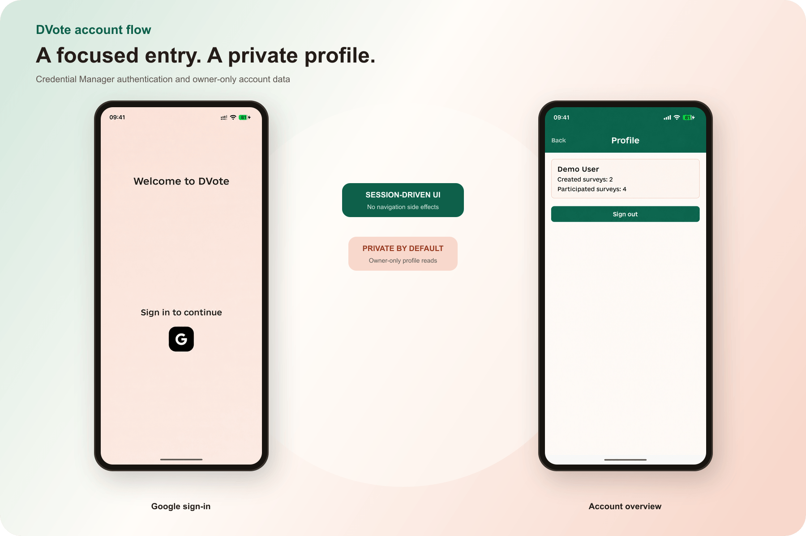
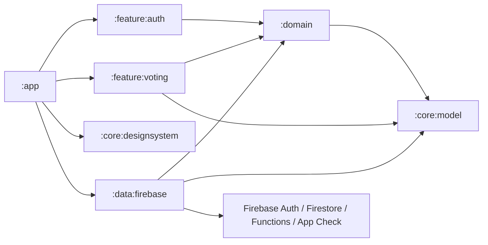
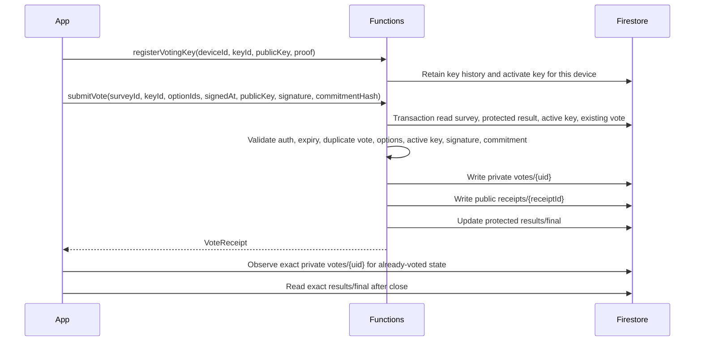

# DVote

DVote is a portfolio Android project for verifiable Firebase-backed voting. It demonstrates a modern Compose multi-module architecture, Firebase Authentication, Firestore public reads, Cloud Functions-owned writes, App Check, signed vote submissions, and public receipt hashes.

This is **not blockchain decentralization**. Firebase and Cloud Functions are the trusted authority; verifiability comes from signed client payloads, private raw votes, immutable public receipts, and transactionally updated aggregate results that become public only after closing.



<details>
<summary>Authentication and private profile</summary>



</details>

## Highlights

- Architecture-first Android app with focused Gradle modules and clear domain/data boundaries.
- Navigation uses stable Navigation 3 with one saved, type-safe back stack and destination-scoped ViewModels.
- Feature UI follows a route/screen split: routes connect state and platform integrations; screens remain stateless and preview/test friendly.
- Authentication is modeled as session state (`Checking`, `SignedOut`, `SignedIn`), not navigation side effects.
- Firebase writes are moved behind callable Cloud Functions: `createSurvey` and `submitVote`.
- Feature modules depend on repository interfaces, not Firebase SDK classes.
- Compose screens use immutable UI state, lifecycle-aware flow collection, Material 3, and explicit loading/error/empty states.
- English and Ukrainian UI resources include locale-aware dates/plurals and Android 13 per-app language support.
- Typed localized errors, semantic headings/live regions, labeled symbol controls, and single-action selection rows keep backend details out of accessible UI.
- Raw votes are private to the voter; receipts require an exact identifier, and aggregate results remain private until the survey closes.
- Active surveys expire from the open feed without an app restart, and the exact owner-readable vote document restores already-voted state after destination recreation.
- Release hardening includes `allowBackup=false`, explicit backup exclusions, App Check, minification/shrinking, and property/env-based signing.

## Architecture



### Modules

- `:app` — Hilt application, session-driven app shell, `MainNavigation`, Navigation 3 keys/back stack, Firebase security initialization.
- `:core:model` — stable models: `AuthState`, `Survey`, `SurveyOption`, `SurveyResult`, `VotingKey`, `VoteSubmission`, `VoteReceipt`, `UserProfile`.
- `:core:designsystem` — Material 3 theme, typography, cards, loading/error/empty/action components.
- `:domain` — platform-agnostic repository contracts plus only the business use cases that add validation/signing behavior.
- `:data:firebase` — Firebase implementations, exact raw-map document/response decoders, Android Keystore vote signer, Hilt bindings.
- `:feature:auth` — `AuthRoute` integration boundary, stateless `AuthScreen`, Credential Manager Google sign-in, and UI state.
- `:feature:voting` — survey list, survey creation, voting/receipt flow, profile screen.

## Firebase Security Model



### Firestore Access

- Public metadata reads: `/surveys/{surveyId}` documents declaring `resultsVisibility = "after_close"`.
- Conditional public reads: exact `/surveys/{surveyId}/results/final` only after server-confirmed close.
- Public receipt lookup: exact `/surveys/{surveyId}/receipts/{receiptId}` when the identifier is already known.
- Private reads: `/users/{uid}`, its `keys`/`devices` history, and `/surveys/{surveyId}/votes/{uid}` only for the owner.
- Client writes: only owner profile creation and bounded display-name updates. A legacy profile public key may remain but cannot be replaced directly.
- Function-owned writes: key/device lifecycle records, surveys, votes, receipts, result aggregates, created/voted survey arrays.
- Denied: active result reads, result/receipt collection listing, public raw vote reads, spoofed profile writes, direct survey writes, direct vote writes, and client result manipulation.

### Vote Verification

- The client signs `survey={id}|user={uid}|key={keyId}|options={sortedIds}|signedAt={millis}` using an account/install-scoped Android Keystore EC key.
- `submitVote` requires that key to be active in the user's private key history, verifies the P-256 signature, and checks the commitment hash.
- The public receipt stores only the commitment hash and accepted timestamp, not raw option choices.
- Duplicate votes are blocked by the private `/votes/{uid}` document inside a Firestore transaction.
- Android treats a survey as active only while `isActive == true && expiresAt > now`; the home feed and voting destination remove/close it as the injected clock advances.
- The authenticated user's exact private vote document is the authoritative already-voted state across destination recreation, while a successful callable response disables interaction immediately.

## Setup

1. Install JDK 17 for Android builds, JDK 21 for the Firestore emulator, Node.js 22.12 or newer within the Node 22 release line, Android SDK Platform 36.1, and Android SDK Build-Tools 36.0.0 or newer.
2. Create a Firebase project with Authentication, Firestore, Functions, App Check, and Crashlytics enabled.
3. Register Android package `com.dvote`.
4. Copy Firebase config:
   ```bash
   cp app/google-services.json.example app/google-services.json
   ```
   Replace it with the real file from Firebase before running against a real backend.
5. Create local secrets:
   ```bash
   cp local.defaults.properties secret.properties
   ```
   Set `WEB_CLIENT_ID` to the OAuth web client ID used by Google sign-in.
6. Deploy backend rules/functions when ready:
   ```bash
   firebase deploy --only firestore,functions
   ```

Current compatible Android toolchain:

- Android Gradle Plugin `9.2.1`
- Gradle `9.5.1`
- Kotlin `2.3.21`
- KSP `2.3.6`
- Hilt `2.59.2`
- Navigation 3 `1.1.2`
- compileSdk `36.1`, targetSdk `36`

Kotlin `2.4.0` is newer, but Hilt `2.59.2` cannot read Kotlin metadata `2.4` yet, so the project deliberately stays on Kotlin `2.3.21`.

AndroidX Core `1.19.0` requires compileSdk 37, so the project deliberately keeps Core `1.18.0` until the SDK 37 migration is handled as a separate toolchain upgrade.

Backend validation uses Node.js `22.12+`, JDK `21`, and the repository-pinned Firebase CLI. Android builds use JDK `17`.

`secret.properties`, `local.properties`, the real `.firebaserc`, real
`app/google-services.json`, keystores, and Node/Gradle build outputs are
intentionally ignored. Copy `.firebaserc.example` locally or run
`firebase use --add` before deploying to your own Firebase project.

## Release Signing

Release signing is controlled by Gradle properties or environment variables:

```properties
DVOTE_RELEASE_STORE_FILE=/absolute/path/to/release.keystore
DVOTE_RELEASE_STORE_PASSWORD=...
DVOTE_RELEASE_KEY_ALIAS=...
DVOTE_RELEASE_KEY_PASSWORD=...
DVOTE_RELEASE_CERT_SHA256=...
DVOTE_UPLOAD_CRASHLYTICS_MAPPING=false
```

`assembleRelease` requires all five `DVOTE_RELEASE_*` values. Missing or partial input fails with a configuration error; the distribution variant never falls back to the debug key. After packaging, Gradle runs `apksigner` and fails unless the APK signer matches `DVOTE_RELEASE_CERT_SHA256`.

CI and local release smoke tests use the separate unsigned, minified variant:

```bash
./gradlew :app:assembleUnsignedRelease
```

Its output is `app/build/outputs/apk/unsignedRelease/app-unsignedRelease-unsigned.apk`. It is build evidence, not an installable distribution artifact. Crashlytics mapping upload is disabled for this variant and is opt-in for a signed release through `DVOTE_UPLOAD_CRASHLYTICS_MAPPING=true`.

## Validation

Repository and dependency gates:

```bash
git config --local core.hooksPath .githooks
./scripts/verify-repository.sh
npm --prefix functions ci
npm --prefix firestore-tests ci
npm --prefix functions audit --omit=dev --audit-level=moderate
npm --prefix functions audit --audit-level=high
npm --prefix firestore-tests audit --audit-level=high
```

Android:

```bash
./gradlew lint testDebugUnitTest assembleDebug --no-daemon
```

Minified mapping/repository smoke gate:

```bash
./gradlew :data:firebase:testReleaseUnitTest \
  :feature:voting:testReleaseUnitTest \
  :app:assembleUnsignedRelease \
  --no-daemon
```

Functions:

```bash
npm --prefix functions ci
npm --prefix firestore-tests ci
npm --prefix functions run build
npm --prefix firestore-tests exec -- firebase emulators:exec \
  --project dvote-test \
  --only firestore,functions \
  "FUNCTIONS_EMULATOR_HOST=127.0.0.1:5001 npm --prefix functions test"
```

Firestore rules:

```bash
npm --prefix firestore-tests ci
npm --prefix firestore-tests exec -- firebase emulators:exec \
  --project dvote-test \
  --only firestore \
  "npm --prefix firestore-tests test"
```

`.github/workflows/ci.yml` runs these as separate repository, Android debug,
unsigned release, Functions, and Firestore rules jobs.

Internal engineering rules, implementation stages, test matrices, and review
notes remain local and are intentionally excluded from the portfolio repository.

## Security Highlights

- Private raw vote documents are readable only by the authenticated voter.
- Aggregate result documents are separated from public survey metadata and remain unreadable until closing.
- Receipt documents support exact lookup but cannot be listed or queried as a collection.
- Votes are submitted through Cloud Functions, not direct client Firestore writes.
- Survey creation and vote submission validate schema, ownership, option IDs, expiration, duplicate votes, public key binding, signatures, and commitment hashes.
- Android rejects unknown, missing, mismatched, fractional, or out-of-range Firestore/callable fields without reflection-based DTO decoding; malformed feed entries are isolated.
- Transient Firebase status codes receive bounded retry backoff, while persistent invalid-data and rejected-operation failures fail closed.
- App Check uses Debug provider in debug builds and Play Integrity in release builds.
- Public receipts allow users to verify accepted submissions without exposing raw choices.

## Known Limitations

- Firebase/Functions remain trusted infrastructure; this is not decentralized consensus.
- Receipt hashes prove accepted signed submissions, not independent public recount of private choices.
- Reinstalling or clearing app data creates a new installation identity and key; old installation keys remain active until explicitly revoked so another device is not silently invalidated.
- Screenshots are SVG portfolio previews; replace them with real emulator/device captures before publishing a final portfolio page.
